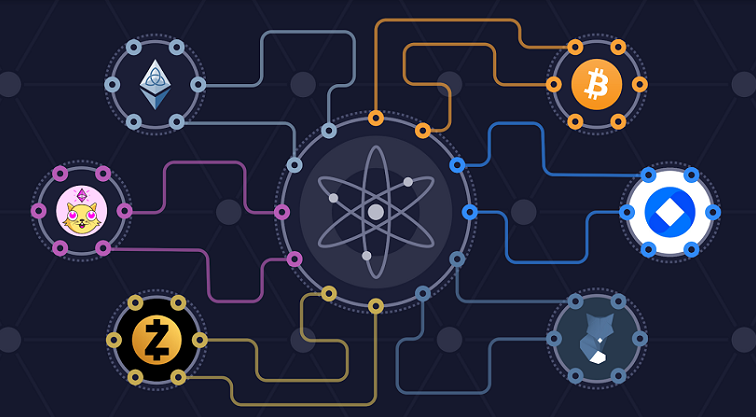

**ABOUT THE PROJECT**
  
  Building a cryptocurrency used in gaming exchanges 
  

**What is [Cosmos Network](https://docs.cosmos.network/master/)?**:
  
 - Cosmos is a decentrilized network of independent parallele blockchains, each powred by BFT Consensus like Tedermint consensus.
 
**What cosmos Provides?**:
  - [IBC Protocol](https://cosmos.network/ibc) : A protocol used to connect blockchains under cosmos network.
  - [Tendermint core](https://tendermint.com/core/) : A Byzantine Fault Tolerant (BFT) middleware that takes a state transition machine - written in any programming language - and securely replicates it on many machines.
  - [Cosmos-SDK](https://cosmos.network/sdk) : an open-source framework for building multi-asset public Proof-of-Stake (PoS) blockchains.
  
**What is [Cosmos scaffold](https://github.com/cosmos/scaffold)?**:

   Automate the build process of generating CLI and REST server for new modules, in this project we used starter application *lvl-1* that provides: Auth, Bank, Distribution, Genutil, Genaccounts, Params, Slashing, Staking, Supply.
   
  
   
  - **auth**: This module defines accounts and fees and gives access to these functionalities to the rest of your application.
  - **bank**: This module enables the application to create and manage tokens and token balances.
  - **staking** : This module enables the application to have validators that people can delegate to.
  - **distribution** : This module give a functional way to passively distribute rewards between validators and delegators.
  - **slashing** : This module disincentivizes people with value staked in the network, ie. Validators.
  - **supply** : This module holds the total supply of the chain.
  
  The main Core logic (Module) of our application doesn't exist yet.

  
